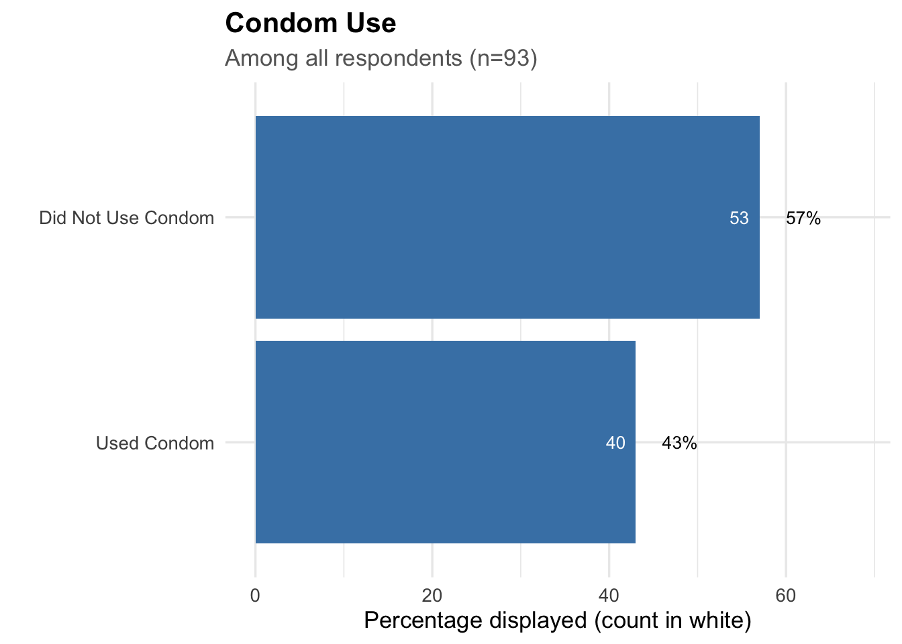
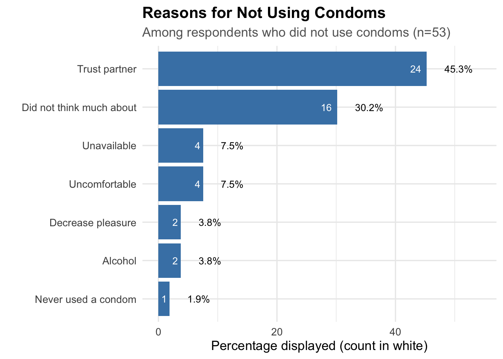
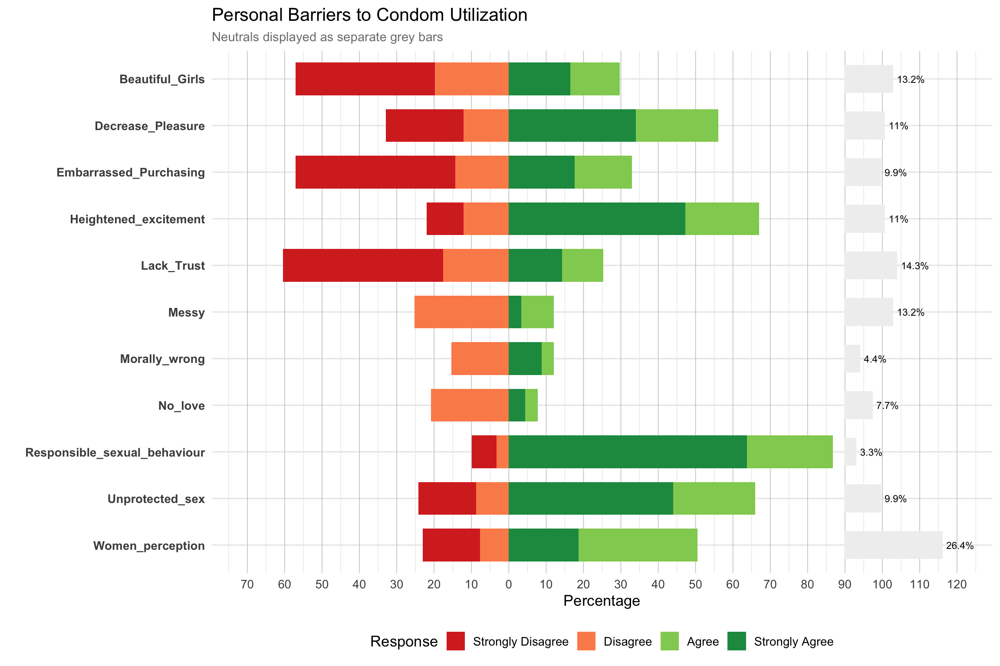
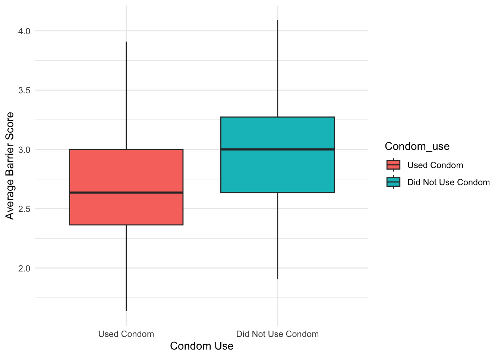

*Department of Nursing, Faculty of Health Sciences, National University of Lesotho*

**Packages**


::: {.cell}

```{.r .cell-code}
req_pkgs <- c("readxl",
              "dplyr",
              "tidyr",
              "here",
              "ggplot2",
              "gtsummary",
              "forcats",
              "broom"
)
install_if_missing <- function(pkgs){
  for(p in pkgs){
    if(!requireNamespace(p, quietly=TRUE)){
      install.packages(p, repos="https://cloud.r-project.org")
    }
    library(p, character.only=TRUE)
  }
}
install_if_missing(req_pkgs)
```
:::


# **(1) Variable formatting and main outcome**

Main outcome Condom use & Reasons for non-use


::: {.cell}

```{.r .cell-code}
# Import
df <- read_excel(here("df.xlsx"))

# Remove row with "#NULL!"
df <- df %>%
  filter(!if_any(everything(), ~ . == "#NULL!"))

# Numeric continuous variables
numeric_vars <- c("Age", "Duration", "Age_Difference", "Duration_Dating")

# Ordinal Likert-scale variables (1–5), others convert to factor for now
likert_vars <- c(
  "Lack_Trust", "Enhance_Pleasure", "Decrease_Pleasure", "Beautiful_Girls",
  "No_love", "Suggest_Use", "Morally_wrong", "Messy", "Unprotected_sex",
  "Heightened_excitement", "Responsible_sexual_behaviour", "Women_perception",
  "Embarrassed_Purchasing", "Confident_putting_on", "Regret_Later",
  "Religion_and_Culture", "Less_masculine", "Woman_Resposibility", "Promiscuity",
  "Taboo", "Personal_Choice", "Prevent_STIs", "Effective_Contraception", "Easy_Use",
  "Expensive", "Easily_Available", "Poor_Quality", "Comfortable", "Dry_out",
  "Breakage", "Bad_smell"
)

# Convert variables to appropriate types
df <- df %>%
  mutate(
    # Convert numeric vars to numeric
    across(all_of(numeric_vars), ~ as.numeric(.)),

    # Convert Likert vars to ordered factors
    across(all_of(likert_vars), ~ factor(as.numeric(.), 
                                         levels = 1:5, 
                                         ordered = TRUE)),

    # Everything else becomes unordered factor
    across(-c(all_of(numeric_vars), all_of(likert_vars)), as.factor)
  )

# Outcome variable and reasons for non-use
df <- df %>%
  mutate(
    Condom_use = as.numeric(Condom_use),
    Disuse = as.numeric(Disuse)
  ) %>%
  mutate(
    Condom_use = factor(
      Condom_use,
      levels = c(1, 2),
      labels = c("Used Condom", "Did Not Use Condom")
    ),
    Disuse = factor(
      Disuse,
      levels = 1:8,
      labels = c(
        "Alcohol",
        "Use condoms?",
        "Trust partner",
        "Uncomfortable",
        "Did not think much about",
        "Unavailable",
        "Decrease pleasure",
        "Never used a condom"
      )
    )
  )

# Prepare plot data incl. percentages
cds_use <- df %>%
  count(Condom_use) %>%
  mutate(percent = n / sum(n) * 100) %>%
  arrange(desc(n))
reason_counts <- df %>%
  filter(Condom_use == "Did Not Use Condom") %>%
  count(Disuse) %>%
  mutate(percent = n / sum(n) * 100) %>%
  arrange(desc(n))

# Plot: Condom use
ggplot(cds_use, aes(x = reorder(Condom_use, percent), y = percent)) +
  geom_col(fill = "steelblue") +
  geom_text(aes(label = n),           # counts inside bar
            hjust = 1.5, color = "white", size = 3.5) +  # moved left
  geom_text(aes(y = percent + 3,      # percentages outside bar
                label = paste0(round(percent, 1), "%")), 
            hjust = 0, size = 3.5) +
  coord_flip() +
  labs(
    title = "Condom Use",
    subtitle = "Among all respondents (n=93)",
    x = "",
    y = "Percentage displayed (count in white)"
  ) +
  theme_minimal(base_size = 13) +
  theme(
    plot.title = element_text(face = "bold"),
    plot.subtitle = element_text(color = "gray40")
  ) +
  expand_limits(y = max(cds_use$percent) * 1.2)
```

::: {.cell-output-display}
{width=672}
:::

```{.r .cell-code}
# Plot: Reasons for not using condoms
ggplot(reason_counts, aes(x = reorder(Disuse, percent), y = percent)) +
  geom_col(fill = "steelblue") +
  geom_text(aes(label = n),           # counts inside bar
            hjust = 1.5, color = "white", size = 3.5) +  # moved left
  geom_text(aes(y = percent + 3,      # percentages outside bar
                label = paste0(round(percent, 1), "%")), 
            hjust = 0, size = 3.5) +
  coord_flip() +
  labs(
    title = "Reasons for Not Using Condoms",
    subtitle = "Among respondents who did not use condoms (n=53)",
    x = "",
    y = "Percentage displayed (count in white)"
  ) +
  theme_minimal(base_size = 13) +
  theme(
    plot.title = element_text(face = "bold"),
    plot.subtitle = element_text(color = "gray40")
  ) +
  expand_limits(y = max(reason_counts$percent) * 1.2)
```

::: {.cell-output-display}
{width=672}
:::
:::


# **(2) Baseline table**

-- Add variable levels ––


::: {.cell}

```{.r .cell-code}
# Baseline characteristics, keeping Condom_use for stratification
baseline_vars <- df %>%
  select(Age, Marriage, Duration, Relationship, Age_Difference,
         Duration_Dating, Qualification, Income, Religion, Condom_use)

tbl_baseline <- tbl_summary(
  data = baseline_vars,
  by = Condom_use,
  type = list(
    Age ~ "continuous",
    Duration ~ "continuous",
    Age_Difference ~ "continuous",
    Duration_Dating ~ "continuous"
  ),
  statistic = list(
    all_continuous() ~ "{mean} ({sd})",
    all_categorical() ~ "{n} ({p}%)"
  ),
  missing = "no"
) %>%
  add_overall() %>%
  bold_labels() %>%
  modify_header(label = "**Variable**") %>%
  modify_caption("**Baseline Table Stratified by Condom Use**")

tbl_baseline
```

::: {.cell-output-display}

```{=html}
<div id="wowzcghoxi" style="padding-left:0px;padding-right:0px;padding-top:10px;padding-bottom:10px;overflow-x:auto;overflow-y:auto;width:auto;height:auto;">
<style>#wowzcghoxi table {
  font-family: system-ui, 'Segoe UI', Roboto, Helvetica, Arial, sans-serif, 'Apple Color Emoji', 'Segoe UI Emoji', 'Segoe UI Symbol', 'Noto Color Emoji';
  -webkit-font-smoothing: antialiased;
  -moz-osx-font-smoothing: grayscale;
}

#wowzcghoxi thead, #wowzcghoxi tbody, #wowzcghoxi tfoot, #wowzcghoxi tr, #wowzcghoxi td, #wowzcghoxi th {
  border-style: none;
}

#wowzcghoxi p {
  margin: 0;
  padding: 0;
}

#wowzcghoxi .gt_table {
  display: table;
  border-collapse: collapse;
  line-height: normal;
  margin-left: auto;
  margin-right: auto;
  color: #333333;
  font-size: 16px;
  font-weight: normal;
  font-style: normal;
  background-color: #FFFFFF;
  width: auto;
  border-top-style: solid;
  border-top-width: 2px;
  border-top-color: #A8A8A8;
  border-right-style: none;
  border-right-width: 2px;
  border-right-color: #D3D3D3;
  border-bottom-style: solid;
  border-bottom-width: 2px;
  border-bottom-color: #A8A8A8;
  border-left-style: none;
  border-left-width: 2px;
  border-left-color: #D3D3D3;
}

#wowzcghoxi .gt_caption {
  padding-top: 4px;
  padding-bottom: 4px;
}

#wowzcghoxi .gt_title {
  color: #333333;
  font-size: 125%;
  font-weight: initial;
  padding-top: 4px;
  padding-bottom: 4px;
  padding-left: 5px;
  padding-right: 5px;
  border-bottom-color: #FFFFFF;
  border-bottom-width: 0;
}

#wowzcghoxi .gt_subtitle {
  color: #333333;
  font-size: 85%;
  font-weight: initial;
  padding-top: 3px;
  padding-bottom: 5px;
  padding-left: 5px;
  padding-right: 5px;
  border-top-color: #FFFFFF;
  border-top-width: 0;
}

#wowzcghoxi .gt_heading {
  background-color: #FFFFFF;
  text-align: center;
  border-bottom-color: #FFFFFF;
  border-left-style: none;
  border-left-width: 1px;
  border-left-color: #D3D3D3;
  border-right-style: none;
  border-right-width: 1px;
  border-right-color: #D3D3D3;
}

#wowzcghoxi .gt_bottom_border {
  border-bottom-style: solid;
  border-bottom-width: 2px;
  border-bottom-color: #D3D3D3;
}

#wowzcghoxi .gt_col_headings {
  border-top-style: solid;
  border-top-width: 2px;
  border-top-color: #D3D3D3;
  border-bottom-style: solid;
  border-bottom-width: 2px;
  border-bottom-color: #D3D3D3;
  border-left-style: none;
  border-left-width: 1px;
  border-left-color: #D3D3D3;
  border-right-style: none;
  border-right-width: 1px;
  border-right-color: #D3D3D3;
}

#wowzcghoxi .gt_col_heading {
  color: #333333;
  background-color: #FFFFFF;
  font-size: 100%;
  font-weight: normal;
  text-transform: inherit;
  border-left-style: none;
  border-left-width: 1px;
  border-left-color: #D3D3D3;
  border-right-style: none;
  border-right-width: 1px;
  border-right-color: #D3D3D3;
  vertical-align: bottom;
  padding-top: 5px;
  padding-bottom: 6px;
  padding-left: 5px;
  padding-right: 5px;
  overflow-x: hidden;
}

#wowzcghoxi .gt_column_spanner_outer {
  color: #333333;
  background-color: #FFFFFF;
  font-size: 100%;
  font-weight: normal;
  text-transform: inherit;
  padding-top: 0;
  padding-bottom: 0;
  padding-left: 4px;
  padding-right: 4px;
}

#wowzcghoxi .gt_column_spanner_outer:first-child {
  padding-left: 0;
}

#wowzcghoxi .gt_column_spanner_outer:last-child {
  padding-right: 0;
}

#wowzcghoxi .gt_column_spanner {
  border-bottom-style: solid;
  border-bottom-width: 2px;
  border-bottom-color: #D3D3D3;
  vertical-align: bottom;
  padding-top: 5px;
  padding-bottom: 5px;
  overflow-x: hidden;
  display: inline-block;
  width: 100%;
}

#wowzcghoxi .gt_spanner_row {
  border-bottom-style: hidden;
}

#wowzcghoxi .gt_group_heading {
  padding-top: 8px;
  padding-bottom: 8px;
  padding-left: 5px;
  padding-right: 5px;
  color: #333333;
  background-color: #FFFFFF;
  font-size: 100%;
  font-weight: initial;
  text-transform: inherit;
  border-top-style: solid;
  border-top-width: 2px;
  border-top-color: #D3D3D3;
  border-bottom-style: solid;
  border-bottom-width: 2px;
  border-bottom-color: #D3D3D3;
  border-left-style: none;
  border-left-width: 1px;
  border-left-color: #D3D3D3;
  border-right-style: none;
  border-right-width: 1px;
  border-right-color: #D3D3D3;
  vertical-align: middle;
  text-align: left;
}

#wowzcghoxi .gt_empty_group_heading {
  padding: 0.5px;
  color: #333333;
  background-color: #FFFFFF;
  font-size: 100%;
  font-weight: initial;
  border-top-style: solid;
  border-top-width: 2px;
  border-top-color: #D3D3D3;
  border-bottom-style: solid;
  border-bottom-width: 2px;
  border-bottom-color: #D3D3D3;
  vertical-align: middle;
}

#wowzcghoxi .gt_from_md > :first-child {
  margin-top: 0;
}

#wowzcghoxi .gt_from_md > :last-child {
  margin-bottom: 0;
}

#wowzcghoxi .gt_row {
  padding-top: 8px;
  padding-bottom: 8px;
  padding-left: 5px;
  padding-right: 5px;
  margin: 10px;
  border-top-style: solid;
  border-top-width: 1px;
  border-top-color: #D3D3D3;
  border-left-style: none;
  border-left-width: 1px;
  border-left-color: #D3D3D3;
  border-right-style: none;
  border-right-width: 1px;
  border-right-color: #D3D3D3;
  vertical-align: middle;
  overflow-x: hidden;
}

#wowzcghoxi .gt_stub {
  color: #333333;
  background-color: #FFFFFF;
  font-size: 100%;
  font-weight: initial;
  text-transform: inherit;
  border-right-style: solid;
  border-right-width: 2px;
  border-right-color: #D3D3D3;
  padding-left: 5px;
  padding-right: 5px;
}

#wowzcghoxi .gt_stub_row_group {
  color: #333333;
  background-color: #FFFFFF;
  font-size: 100%;
  font-weight: initial;
  text-transform: inherit;
  border-right-style: solid;
  border-right-width: 2px;
  border-right-color: #D3D3D3;
  padding-left: 5px;
  padding-right: 5px;
  vertical-align: top;
}

#wowzcghoxi .gt_row_group_first td {
  border-top-width: 2px;
}

#wowzcghoxi .gt_row_group_first th {
  border-top-width: 2px;
}

#wowzcghoxi .gt_summary_row {
  color: #333333;
  background-color: #FFFFFF;
  text-transform: inherit;
  padding-top: 8px;
  padding-bottom: 8px;
  padding-left: 5px;
  padding-right: 5px;
}

#wowzcghoxi .gt_first_summary_row {
  border-top-style: solid;
  border-top-color: #D3D3D3;
}

#wowzcghoxi .gt_first_summary_row.thick {
  border-top-width: 2px;
}

#wowzcghoxi .gt_last_summary_row {
  padding-top: 8px;
  padding-bottom: 8px;
  padding-left: 5px;
  padding-right: 5px;
  border-bottom-style: solid;
  border-bottom-width: 2px;
  border-bottom-color: #D3D3D3;
}

#wowzcghoxi .gt_grand_summary_row {
  color: #333333;
  background-color: #FFFFFF;
  text-transform: inherit;
  padding-top: 8px;
  padding-bottom: 8px;
  padding-left: 5px;
  padding-right: 5px;
}

#wowzcghoxi .gt_first_grand_summary_row {
  padding-top: 8px;
  padding-bottom: 8px;
  padding-left: 5px;
  padding-right: 5px;
  border-top-style: double;
  border-top-width: 6px;
  border-top-color: #D3D3D3;
}

#wowzcghoxi .gt_last_grand_summary_row_top {
  padding-top: 8px;
  padding-bottom: 8px;
  padding-left: 5px;
  padding-right: 5px;
  border-bottom-style: double;
  border-bottom-width: 6px;
  border-bottom-color: #D3D3D3;
}

#wowzcghoxi .gt_striped {
  background-color: rgba(128, 128, 128, 0.05);
}

#wowzcghoxi .gt_table_body {
  border-top-style: solid;
  border-top-width: 2px;
  border-top-color: #D3D3D3;
  border-bottom-style: solid;
  border-bottom-width: 2px;
  border-bottom-color: #D3D3D3;
}

#wowzcghoxi .gt_footnotes {
  color: #333333;
  background-color: #FFFFFF;
  border-bottom-style: none;
  border-bottom-width: 2px;
  border-bottom-color: #D3D3D3;
  border-left-style: none;
  border-left-width: 2px;
  border-left-color: #D3D3D3;
  border-right-style: none;
  border-right-width: 2px;
  border-right-color: #D3D3D3;
}

#wowzcghoxi .gt_footnote {
  margin: 0px;
  font-size: 90%;
  padding-top: 4px;
  padding-bottom: 4px;
  padding-left: 5px;
  padding-right: 5px;
}

#wowzcghoxi .gt_sourcenotes {
  color: #333333;
  background-color: #FFFFFF;
  border-bottom-style: none;
  border-bottom-width: 2px;
  border-bottom-color: #D3D3D3;
  border-left-style: none;
  border-left-width: 2px;
  border-left-color: #D3D3D3;
  border-right-style: none;
  border-right-width: 2px;
  border-right-color: #D3D3D3;
}

#wowzcghoxi .gt_sourcenote {
  font-size: 90%;
  padding-top: 4px;
  padding-bottom: 4px;
  padding-left: 5px;
  padding-right: 5px;
}

#wowzcghoxi .gt_left {
  text-align: left;
}

#wowzcghoxi .gt_center {
  text-align: center;
}

#wowzcghoxi .gt_right {
  text-align: right;
  font-variant-numeric: tabular-nums;
}

#wowzcghoxi .gt_font_normal {
  font-weight: normal;
}

#wowzcghoxi .gt_font_bold {
  font-weight: bold;
}

#wowzcghoxi .gt_font_italic {
  font-style: italic;
}

#wowzcghoxi .gt_super {
  font-size: 65%;
}

#wowzcghoxi .gt_footnote_marks {
  font-size: 75%;
  vertical-align: 0.4em;
  position: initial;
}

#wowzcghoxi .gt_asterisk {
  font-size: 100%;
  vertical-align: 0;
}

#wowzcghoxi .gt_indent_1 {
  text-indent: 5px;
}

#wowzcghoxi .gt_indent_2 {
  text-indent: 10px;
}

#wowzcghoxi .gt_indent_3 {
  text-indent: 15px;
}

#wowzcghoxi .gt_indent_4 {
  text-indent: 20px;
}

#wowzcghoxi .gt_indent_5 {
  text-indent: 25px;
}

#wowzcghoxi .katex-display {
  display: inline-flex !important;
  margin-bottom: 0.75em !important;
}

#wowzcghoxi div.Reactable > div.rt-table > div.rt-thead > div.rt-tr.rt-tr-group-header > div.rt-th-group:after {
  height: 0px !important;
}
</style>
<table class="gt_table" data-quarto-disable-processing="false" data-quarto-bootstrap="false">
  <caption><span data-qmd-base64="KipCYXNlbGluZSBUYWJsZSBTdHJhdGlmaWVkIGJ5IENvbmRvbSBVc2UqKg=="><span class='gt_from_md'><strong>Baseline Table Stratified by Condom Use</strong></span></span></caption>
  <thead>
    <tr class="gt_col_headings">
      <th class="gt_col_heading gt_columns_bottom_border gt_left" rowspan="1" colspan="1" scope="col" id="label"><span data-qmd-base64="KipWYXJpYWJsZSoq"><span class='gt_from_md'><strong>Variable</strong></span></span></th>
      <th class="gt_col_heading gt_columns_bottom_border gt_center" rowspan="1" colspan="1" scope="col" id="stat_0"><span data-qmd-base64="KipPdmVyYWxsKiogIApOID0gOTM="><span class='gt_from_md'><strong>Overall</strong><br />
N = 93</span></span><span class="gt_footnote_marks" style="white-space:nowrap;font-style:italic;font-weight:normal;line-height:0;"><sup>1</sup></span></th>
      <th class="gt_col_heading gt_columns_bottom_border gt_center" rowspan="1" colspan="1" scope="col" id="stat_1"><span data-qmd-base64="KipVc2VkIENvbmRvbSoqICAKTiA9IDQw"><span class='gt_from_md'><strong>Used Condom</strong><br />
N = 40</span></span><span class="gt_footnote_marks" style="white-space:nowrap;font-style:italic;font-weight:normal;line-height:0;"><sup>1</sup></span></th>
      <th class="gt_col_heading gt_columns_bottom_border gt_center" rowspan="1" colspan="1" scope="col" id="stat_2"><span data-qmd-base64="KipEaWQgTm90IFVzZSBDb25kb20qKiAgCk4gPSA1Mw=="><span class='gt_from_md'><strong>Did Not Use Condom</strong><br />
N = 53</span></span><span class="gt_footnote_marks" style="white-space:nowrap;font-style:italic;font-weight:normal;line-height:0;"><sup>1</sup></span></th>
    </tr>
  </thead>
  <tbody class="gt_table_body">
    <tr><td headers="label" class="gt_row gt_left" style="font-weight: bold;">Age</td>
<td headers="stat_0" class="gt_row gt_center">27 (7)</td>
<td headers="stat_1" class="gt_row gt_center">28 (7)</td>
<td headers="stat_2" class="gt_row gt_center">26 (6)</td></tr>
    <tr><td headers="label" class="gt_row gt_left" style="font-weight: bold;">Marriage</td>
<td headers="stat_0" class="gt_row gt_center"><br /></td>
<td headers="stat_1" class="gt_row gt_center"><br /></td>
<td headers="stat_2" class="gt_row gt_center"><br /></td></tr>
    <tr><td headers="label" class="gt_row gt_left">    1.000000</td>
<td headers="stat_0" class="gt_row gt_center">28 (30%)</td>
<td headers="stat_1" class="gt_row gt_center">13 (33%)</td>
<td headers="stat_2" class="gt_row gt_center">15 (28%)</td></tr>
    <tr><td headers="label" class="gt_row gt_left">    2.000000</td>
<td headers="stat_0" class="gt_row gt_center">64 (69%)</td>
<td headers="stat_1" class="gt_row gt_center">26 (65%)</td>
<td headers="stat_2" class="gt_row gt_center">38 (72%)</td></tr>
    <tr><td headers="label" class="gt_row gt_left">    22.000000</td>
<td headers="stat_0" class="gt_row gt_center">1 (1.1%)</td>
<td headers="stat_1" class="gt_row gt_center">1 (2.5%)</td>
<td headers="stat_2" class="gt_row gt_center">0 (0%)</td></tr>
    <tr><td headers="label" class="gt_row gt_left" style="font-weight: bold;">Duration</td>
<td headers="stat_0" class="gt_row gt_center">715 (447)</td>
<td headers="stat_1" class="gt_row gt_center">703 (458)</td>
<td headers="stat_2" class="gt_row gt_center">724 (443)</td></tr>
    <tr><td headers="label" class="gt_row gt_left" style="font-weight: bold;">Relationship</td>
<td headers="stat_0" class="gt_row gt_center"><br /></td>
<td headers="stat_1" class="gt_row gt_center"><br /></td>
<td headers="stat_2" class="gt_row gt_center"><br /></td></tr>
    <tr><td headers="label" class="gt_row gt_left">    111.000000</td>
<td headers="stat_0" class="gt_row gt_center">30 (32%)</td>
<td headers="stat_1" class="gt_row gt_center">14 (35%)</td>
<td headers="stat_2" class="gt_row gt_center">16 (30%)</td></tr>
    <tr><td headers="label" class="gt_row gt_left">    2.000000</td>
<td headers="stat_0" class="gt_row gt_center">2 (2.2%)</td>
<td headers="stat_1" class="gt_row gt_center">0 (0%)</td>
<td headers="stat_2" class="gt_row gt_center">2 (3.8%)</td></tr>
    <tr><td headers="label" class="gt_row gt_left">    3.000000</td>
<td headers="stat_0" class="gt_row gt_center">48 (52%)</td>
<td headers="stat_1" class="gt_row gt_center">20 (50%)</td>
<td headers="stat_2" class="gt_row gt_center">28 (53%)</td></tr>
    <tr><td headers="label" class="gt_row gt_left">    4.000000</td>
<td headers="stat_0" class="gt_row gt_center">13 (14%)</td>
<td headers="stat_1" class="gt_row gt_center">6 (15%)</td>
<td headers="stat_2" class="gt_row gt_center">7 (13%)</td></tr>
    <tr><td headers="label" class="gt_row gt_left" style="font-weight: bold;">Age_Difference</td>
<td headers="stat_0" class="gt_row gt_center">37 (69)</td>
<td headers="stat_1" class="gt_row gt_center">34 (67)</td>
<td headers="stat_2" class="gt_row gt_center">39 (71)</td></tr>
    <tr><td headers="label" class="gt_row gt_left" style="font-weight: bold;">Duration_Dating</td>
<td headers="stat_0" class="gt_row gt_center">100 (90)</td>
<td headers="stat_1" class="gt_row gt_center">107 (88)</td>
<td headers="stat_2" class="gt_row gt_center">94 (91)</td></tr>
    <tr><td headers="label" class="gt_row gt_left" style="font-weight: bold;">Qualification</td>
<td headers="stat_0" class="gt_row gt_center"><br /></td>
<td headers="stat_1" class="gt_row gt_center"><br /></td>
<td headers="stat_2" class="gt_row gt_center"><br /></td></tr>
    <tr><td headers="label" class="gt_row gt_left">    1.000000</td>
<td headers="stat_0" class="gt_row gt_center">9 (9.7%)</td>
<td headers="stat_1" class="gt_row gt_center">6 (15%)</td>
<td headers="stat_2" class="gt_row gt_center">3 (5.7%)</td></tr>
    <tr><td headers="label" class="gt_row gt_left">    2.000000</td>
<td headers="stat_0" class="gt_row gt_center">11 (12%)</td>
<td headers="stat_1" class="gt_row gt_center">5 (13%)</td>
<td headers="stat_2" class="gt_row gt_center">6 (11%)</td></tr>
    <tr><td headers="label" class="gt_row gt_left">    3.000000</td>
<td headers="stat_0" class="gt_row gt_center">40 (43%)</td>
<td headers="stat_1" class="gt_row gt_center">17 (43%)</td>
<td headers="stat_2" class="gt_row gt_center">23 (43%)</td></tr>
    <tr><td headers="label" class="gt_row gt_left">    4.000000</td>
<td headers="stat_0" class="gt_row gt_center">31 (33%)</td>
<td headers="stat_1" class="gt_row gt_center">12 (30%)</td>
<td headers="stat_2" class="gt_row gt_center">19 (36%)</td></tr>
    <tr><td headers="label" class="gt_row gt_left">    5.000000</td>
<td headers="stat_0" class="gt_row gt_center">2 (2.2%)</td>
<td headers="stat_1" class="gt_row gt_center">0 (0%)</td>
<td headers="stat_2" class="gt_row gt_center">2 (3.8%)</td></tr>
    <tr><td headers="label" class="gt_row gt_left" style="font-weight: bold;">Income</td>
<td headers="stat_0" class="gt_row gt_center"><br /></td>
<td headers="stat_1" class="gt_row gt_center"><br /></td>
<td headers="stat_2" class="gt_row gt_center"><br /></td></tr>
    <tr><td headers="label" class="gt_row gt_left">    1.000000</td>
<td headers="stat_0" class="gt_row gt_center">23 (25%)</td>
<td headers="stat_1" class="gt_row gt_center">10 (25%)</td>
<td headers="stat_2" class="gt_row gt_center">13 (25%)</td></tr>
    <tr><td headers="label" class="gt_row gt_left">    2.000000</td>
<td headers="stat_0" class="gt_row gt_center">23 (25%)</td>
<td headers="stat_1" class="gt_row gt_center">9 (23%)</td>
<td headers="stat_2" class="gt_row gt_center">14 (26%)</td></tr>
    <tr><td headers="label" class="gt_row gt_left">    3.000000</td>
<td headers="stat_0" class="gt_row gt_center">23 (25%)</td>
<td headers="stat_1" class="gt_row gt_center">11 (28%)</td>
<td headers="stat_2" class="gt_row gt_center">12 (23%)</td></tr>
    <tr><td headers="label" class="gt_row gt_left">    4.000000</td>
<td headers="stat_0" class="gt_row gt_center">24 (26%)</td>
<td headers="stat_1" class="gt_row gt_center">10 (25%)</td>
<td headers="stat_2" class="gt_row gt_center">14 (26%)</td></tr>
    <tr><td headers="label" class="gt_row gt_left" style="font-weight: bold;">Religion</td>
<td headers="stat_0" class="gt_row gt_center"><br /></td>
<td headers="stat_1" class="gt_row gt_center"><br /></td>
<td headers="stat_2" class="gt_row gt_center"><br /></td></tr>
    <tr><td headers="label" class="gt_row gt_left">    1.000000</td>
<td headers="stat_0" class="gt_row gt_center">20 (22%)</td>
<td headers="stat_1" class="gt_row gt_center">7 (18%)</td>
<td headers="stat_2" class="gt_row gt_center">13 (25%)</td></tr>
    <tr><td headers="label" class="gt_row gt_left">    10.000000</td>
<td headers="stat_0" class="gt_row gt_center">1 (1.1%)</td>
<td headers="stat_1" class="gt_row gt_center">1 (2.5%)</td>
<td headers="stat_2" class="gt_row gt_center">0 (0%)</td></tr>
    <tr><td headers="label" class="gt_row gt_left">    11.000000</td>
<td headers="stat_0" class="gt_row gt_center">1 (1.1%)</td>
<td headers="stat_1" class="gt_row gt_center">0 (0%)</td>
<td headers="stat_2" class="gt_row gt_center">1 (1.9%)</td></tr>
    <tr><td headers="label" class="gt_row gt_left">    2.000000</td>
<td headers="stat_0" class="gt_row gt_center">23 (25%)</td>
<td headers="stat_1" class="gt_row gt_center">9 (23%)</td>
<td headers="stat_2" class="gt_row gt_center">14 (26%)</td></tr>
    <tr><td headers="label" class="gt_row gt_left">    3.000000</td>
<td headers="stat_0" class="gt_row gt_center">9 (9.7%)</td>
<td headers="stat_1" class="gt_row gt_center">4 (10%)</td>
<td headers="stat_2" class="gt_row gt_center">5 (9.4%)</td></tr>
    <tr><td headers="label" class="gt_row gt_left">    4.000000</td>
<td headers="stat_0" class="gt_row gt_center">10 (11%)</td>
<td headers="stat_1" class="gt_row gt_center">5 (13%)</td>
<td headers="stat_2" class="gt_row gt_center">5 (9.4%)</td></tr>
    <tr><td headers="label" class="gt_row gt_left">    5.000000</td>
<td headers="stat_0" class="gt_row gt_center">3 (3.2%)</td>
<td headers="stat_1" class="gt_row gt_center">3 (7.5%)</td>
<td headers="stat_2" class="gt_row gt_center">0 (0%)</td></tr>
    <tr><td headers="label" class="gt_row gt_left">    6.000000</td>
<td headers="stat_0" class="gt_row gt_center">3 (3.2%)</td>
<td headers="stat_1" class="gt_row gt_center">1 (2.5%)</td>
<td headers="stat_2" class="gt_row gt_center">2 (3.8%)</td></tr>
    <tr><td headers="label" class="gt_row gt_left">    7.000000</td>
<td headers="stat_0" class="gt_row gt_center">16 (17%)</td>
<td headers="stat_1" class="gt_row gt_center">6 (15%)</td>
<td headers="stat_2" class="gt_row gt_center">10 (19%)</td></tr>
    <tr><td headers="label" class="gt_row gt_left">    8.000000</td>
<td headers="stat_0" class="gt_row gt_center">6 (6.5%)</td>
<td headers="stat_1" class="gt_row gt_center">4 (10%)</td>
<td headers="stat_2" class="gt_row gt_center">2 (3.8%)</td></tr>
    <tr><td headers="label" class="gt_row gt_left">    9.000000</td>
<td headers="stat_0" class="gt_row gt_center">1 (1.1%)</td>
<td headers="stat_1" class="gt_row gt_center">0 (0%)</td>
<td headers="stat_2" class="gt_row gt_center">1 (1.9%)</td></tr>
  </tbody>
  
  <tfoot class="gt_footnotes">
    <tr>
      <td class="gt_footnote" colspan="4"><span class="gt_footnote_marks" style="white-space:nowrap;font-style:italic;font-weight:normal;line-height:0;"><sup>1</sup></span> <span data-qmd-base64="TWVhbiAoU0QpOyBuICglKQ=="><span class='gt_from_md'>Mean (SD); n (%)</span></span></td>
    </tr>
  </tfoot>
</table>
</div>
```

:::
:::


# **(3) Personal Barriers re Condom Use**

-- Add variable levels ––


::: {.cell}

```{.r .cell-code}
likert_vars <- c(
  "Lack_Trust", "Decrease_Pleasure", "Beautiful_Girls", "No_love",
  "Morally_wrong", "Messy", "Unprotected_sex", "Heightened_excitement",
  "Responsible_sexual_behaviour", "Women_perception", "Embarrassed_Purchasing"
)

# Drop rows with NA
df_likert <- df %>%
  select(all_of(likert_vars)) %>%
  drop_na()

# Reshape data
likert_long <- df_likert %>%
  pivot_longer(cols = everything(), names_to = "Variable", values_to = "Response") %>%
  mutate(Response = as.numeric(as.character(Response))) %>%
  mutate(
    Direction = case_when(
      Response %in% c(1,2) ~ "Disagree",
      Response == 3 ~ "Neutral",
      Response %in% c(4,5) ~ "Agree"
    ),
    ResponseLabel = case_when(
      Response == 1 ~ "Strongly Disagree",
      Response == 2 ~ "Disagree",
      Response == 3 ~ "Neutral",
      Response == 4 ~ "Agree",
      Response == 5 ~ "Strongly Agree"
    )
  )

# Percentages
likert_perc <- likert_long %>%
  group_by(Variable, ResponseLabel, Direction) %>%
  summarise(n = n(), .groups = "drop") %>%
  group_by(Variable) %>%
  mutate(percent = n / sum(n) * 100) %>%
  ungroup()

# Diverging percentages
likert_perc <- likert_perc %>%
  mutate(percent_diverge = case_when(
    Direction == "Disagree" ~ -percent,
    Direction == "Agree" ~ percent,
    TRUE ~ 0
  ))

# Drop unused factor levels for plotting
likert_perc$ResponseLabel <- droplevels(factor(likert_perc$ResponseLabel))
likert_perc$Variable <- fct_rev(factor(likert_perc$Variable))

# Factor order for fill
likert_perc$ResponseLabel <- factor(
  likert_perc$ResponseLabel,
  levels = c("Strongly Disagree","Disagree","Agree","Strongly Agree")
)

# Max agree for neutral bar offset
max_agree <- max(likert_perc$percent_diverge[likert_perc$Direction=="Agree"])
neutral_offset <- max_agree + 26

# Dynamic x-axis limits
x_min <- floor(min(likert_perc$percent_diverge[likert_perc$Direction != "Neutral"]) / 10) * 10
neutral_max <- max(likert_perc$percent[likert_perc$Direction == "Neutral"])
x_max <- ceiling((neutral_offset + neutral_max) / 10) * 10

# Subset for diverging bars
likert_perc_div <- subset(likert_perc, Direction != "Neutral")
likert_perc_div$ResponseLabel <- factor(
  likert_perc_div$ResponseLabel,
  levels = c("Strongly Disagree","Disagree","Agree","Strongly Agree")
)
likert_perc_div$Variable <- droplevels(likert_perc_div$Variable)

# Subset for neutral bars with percent > 0
neutral_data <- subset(likert_perc, Direction == "Neutral" & percent > 0)
neutral_data$Variable <- droplevels(neutral_data$Variable)

# Plot
ggplot() +
  # Diverging bars
  geom_col(
    data = likert_perc_div,
    aes(x = percent_diverge, y = Variable, fill = ResponseLabel),
    width = 0.7
  ) +
  # Neutral bars as thin grey rectangles
  geom_rect(
    data = neutral_data,
    aes(
      xmin = neutral_offset,
      xmax = neutral_offset + percent,
      ymin = as.numeric(Variable) - 0.3,
      ymax = as.numeric(Variable) + 0.3
    ),
    fill = "#f0f0f0"
  ) +
  # Neutral labels
  geom_text(
    data = neutral_data,
    aes(
      x = neutral_offset + percent + 1,
      y = as.numeric(Variable),
      label = paste0(round(percent,1),"%")
    ),
    hjust = 0,
    size = 3
  ) +
  # Colors for diverging bars
  scale_fill_manual(
    values = c(
      "Strongly Disagree" = "#d73027",
      "Disagree" = "#fc8d59",
      "Agree" = "#91cf60",
      "Strongly Agree" = "#1a9850"
    )
  ) +
  # X-axis
  scale_x_continuous(
    labels = abs,
    breaks = seq(x_min, x_max, 10),
    limits = c(x_min, x_max)
  ) +
  labs(
    x = "Percentage",
    y = "",
    fill = "Response",
    title = "Personal Barriers to Condom Utilization",
    subtitle = "Neutrals displayed as separate grey bars"
  ) +
  theme_minimal(base_size = 13) +
  theme(
    axis.text.y = element_text(face = "bold"),
    legend.position = "bottom",
    panel.grid.major.x = element_line(color = "gray80", size = 0.3),
    panel.grid.minor.x = element_line(color = "gray90", size = 0.2),
    plot.subtitle = element_text(size = 11, color = "gray50") 
  )
```

::: {.cell-output-display}
{width=1152}
:::
:::


# **(4) Personal Barriers on Condom use**

-- Add variable levels ––


::: {.cell}

```{.r .cell-code}
# Convert Likert factors to numeric and calculate average barrier score
df_numeric <- df %>%
  mutate(across(all_of(likert_vars), ~ as.numeric(as.character(.)))) %>%
  rowwise() %>%
  mutate(
    Barrier_Score = mean(c_across(all_of(likert_vars)), na.rm = TRUE)
  ) %>%
  ungroup()

# Outcome
df_numeric$Condom_use <- factor(df_numeric$Condom_use,
                                levels = c("Used Condom", "Did Not Use Condom"))

# Logistic regression
model_total <- glm(
  Condom_use ~ Barrier_Score,
  data = df_numeric,
  family = binomial
)

# Output
tbl_1 <- model_total %>%
  tbl_regression(
    intercept = TRUE,
    estimate_fun = function(x) style_sigfig(x, digits = 4),
    label = list(Barrier_Score ~ "Average Barrier Score (1–5)"),
    tidy_fun = broom.helpers::tidy_parameters,
    exponentiate = TRUE   # show OR instead of log-odds
  ) %>%
  modify_caption("Association of Average Barrier Score with Condom Use") %>%
  modify_column_hide(columns = "p.value")
tbl_1
```

::: {.cell-output-display}

```{=html}
<div id="ndncuztlme" style="padding-left:0px;padding-right:0px;padding-top:10px;padding-bottom:10px;overflow-x:auto;overflow-y:auto;width:auto;height:auto;">
<style>#ndncuztlme table {
  font-family: system-ui, 'Segoe UI', Roboto, Helvetica, Arial, sans-serif, 'Apple Color Emoji', 'Segoe UI Emoji', 'Segoe UI Symbol', 'Noto Color Emoji';
  -webkit-font-smoothing: antialiased;
  -moz-osx-font-smoothing: grayscale;
}

#ndncuztlme thead, #ndncuztlme tbody, #ndncuztlme tfoot, #ndncuztlme tr, #ndncuztlme td, #ndncuztlme th {
  border-style: none;
}

#ndncuztlme p {
  margin: 0;
  padding: 0;
}

#ndncuztlme .gt_table {
  display: table;
  border-collapse: collapse;
  line-height: normal;
  margin-left: auto;
  margin-right: auto;
  color: #333333;
  font-size: 16px;
  font-weight: normal;
  font-style: normal;
  background-color: #FFFFFF;
  width: auto;
  border-top-style: solid;
  border-top-width: 2px;
  border-top-color: #A8A8A8;
  border-right-style: none;
  border-right-width: 2px;
  border-right-color: #D3D3D3;
  border-bottom-style: solid;
  border-bottom-width: 2px;
  border-bottom-color: #A8A8A8;
  border-left-style: none;
  border-left-width: 2px;
  border-left-color: #D3D3D3;
}

#ndncuztlme .gt_caption {
  padding-top: 4px;
  padding-bottom: 4px;
}

#ndncuztlme .gt_title {
  color: #333333;
  font-size: 125%;
  font-weight: initial;
  padding-top: 4px;
  padding-bottom: 4px;
  padding-left: 5px;
  padding-right: 5px;
  border-bottom-color: #FFFFFF;
  border-bottom-width: 0;
}

#ndncuztlme .gt_subtitle {
  color: #333333;
  font-size: 85%;
  font-weight: initial;
  padding-top: 3px;
  padding-bottom: 5px;
  padding-left: 5px;
  padding-right: 5px;
  border-top-color: #FFFFFF;
  border-top-width: 0;
}

#ndncuztlme .gt_heading {
  background-color: #FFFFFF;
  text-align: center;
  border-bottom-color: #FFFFFF;
  border-left-style: none;
  border-left-width: 1px;
  border-left-color: #D3D3D3;
  border-right-style: none;
  border-right-width: 1px;
  border-right-color: #D3D3D3;
}

#ndncuztlme .gt_bottom_border {
  border-bottom-style: solid;
  border-bottom-width: 2px;
  border-bottom-color: #D3D3D3;
}

#ndncuztlme .gt_col_headings {
  border-top-style: solid;
  border-top-width: 2px;
  border-top-color: #D3D3D3;
  border-bottom-style: solid;
  border-bottom-width: 2px;
  border-bottom-color: #D3D3D3;
  border-left-style: none;
  border-left-width: 1px;
  border-left-color: #D3D3D3;
  border-right-style: none;
  border-right-width: 1px;
  border-right-color: #D3D3D3;
}

#ndncuztlme .gt_col_heading {
  color: #333333;
  background-color: #FFFFFF;
  font-size: 100%;
  font-weight: normal;
  text-transform: inherit;
  border-left-style: none;
  border-left-width: 1px;
  border-left-color: #D3D3D3;
  border-right-style: none;
  border-right-width: 1px;
  border-right-color: #D3D3D3;
  vertical-align: bottom;
  padding-top: 5px;
  padding-bottom: 6px;
  padding-left: 5px;
  padding-right: 5px;
  overflow-x: hidden;
}

#ndncuztlme .gt_column_spanner_outer {
  color: #333333;
  background-color: #FFFFFF;
  font-size: 100%;
  font-weight: normal;
  text-transform: inherit;
  padding-top: 0;
  padding-bottom: 0;
  padding-left: 4px;
  padding-right: 4px;
}

#ndncuztlme .gt_column_spanner_outer:first-child {
  padding-left: 0;
}

#ndncuztlme .gt_column_spanner_outer:last-child {
  padding-right: 0;
}

#ndncuztlme .gt_column_spanner {
  border-bottom-style: solid;
  border-bottom-width: 2px;
  border-bottom-color: #D3D3D3;
  vertical-align: bottom;
  padding-top: 5px;
  padding-bottom: 5px;
  overflow-x: hidden;
  display: inline-block;
  width: 100%;
}

#ndncuztlme .gt_spanner_row {
  border-bottom-style: hidden;
}

#ndncuztlme .gt_group_heading {
  padding-top: 8px;
  padding-bottom: 8px;
  padding-left: 5px;
  padding-right: 5px;
  color: #333333;
  background-color: #FFFFFF;
  font-size: 100%;
  font-weight: initial;
  text-transform: inherit;
  border-top-style: solid;
  border-top-width: 2px;
  border-top-color: #D3D3D3;
  border-bottom-style: solid;
  border-bottom-width: 2px;
  border-bottom-color: #D3D3D3;
  border-left-style: none;
  border-left-width: 1px;
  border-left-color: #D3D3D3;
  border-right-style: none;
  border-right-width: 1px;
  border-right-color: #D3D3D3;
  vertical-align: middle;
  text-align: left;
}

#ndncuztlme .gt_empty_group_heading {
  padding: 0.5px;
  color: #333333;
  background-color: #FFFFFF;
  font-size: 100%;
  font-weight: initial;
  border-top-style: solid;
  border-top-width: 2px;
  border-top-color: #D3D3D3;
  border-bottom-style: solid;
  border-bottom-width: 2px;
  border-bottom-color: #D3D3D3;
  vertical-align: middle;
}

#ndncuztlme .gt_from_md > :first-child {
  margin-top: 0;
}

#ndncuztlme .gt_from_md > :last-child {
  margin-bottom: 0;
}

#ndncuztlme .gt_row {
  padding-top: 8px;
  padding-bottom: 8px;
  padding-left: 5px;
  padding-right: 5px;
  margin: 10px;
  border-top-style: solid;
  border-top-width: 1px;
  border-top-color: #D3D3D3;
  border-left-style: none;
  border-left-width: 1px;
  border-left-color: #D3D3D3;
  border-right-style: none;
  border-right-width: 1px;
  border-right-color: #D3D3D3;
  vertical-align: middle;
  overflow-x: hidden;
}

#ndncuztlme .gt_stub {
  color: #333333;
  background-color: #FFFFFF;
  font-size: 100%;
  font-weight: initial;
  text-transform: inherit;
  border-right-style: solid;
  border-right-width: 2px;
  border-right-color: #D3D3D3;
  padding-left: 5px;
  padding-right: 5px;
}

#ndncuztlme .gt_stub_row_group {
  color: #333333;
  background-color: #FFFFFF;
  font-size: 100%;
  font-weight: initial;
  text-transform: inherit;
  border-right-style: solid;
  border-right-width: 2px;
  border-right-color: #D3D3D3;
  padding-left: 5px;
  padding-right: 5px;
  vertical-align: top;
}

#ndncuztlme .gt_row_group_first td {
  border-top-width: 2px;
}

#ndncuztlme .gt_row_group_first th {
  border-top-width: 2px;
}

#ndncuztlme .gt_summary_row {
  color: #333333;
  background-color: #FFFFFF;
  text-transform: inherit;
  padding-top: 8px;
  padding-bottom: 8px;
  padding-left: 5px;
  padding-right: 5px;
}

#ndncuztlme .gt_first_summary_row {
  border-top-style: solid;
  border-top-color: #D3D3D3;
}

#ndncuztlme .gt_first_summary_row.thick {
  border-top-width: 2px;
}

#ndncuztlme .gt_last_summary_row {
  padding-top: 8px;
  padding-bottom: 8px;
  padding-left: 5px;
  padding-right: 5px;
  border-bottom-style: solid;
  border-bottom-width: 2px;
  border-bottom-color: #D3D3D3;
}

#ndncuztlme .gt_grand_summary_row {
  color: #333333;
  background-color: #FFFFFF;
  text-transform: inherit;
  padding-top: 8px;
  padding-bottom: 8px;
  padding-left: 5px;
  padding-right: 5px;
}

#ndncuztlme .gt_first_grand_summary_row {
  padding-top: 8px;
  padding-bottom: 8px;
  padding-left: 5px;
  padding-right: 5px;
  border-top-style: double;
  border-top-width: 6px;
  border-top-color: #D3D3D3;
}

#ndncuztlme .gt_last_grand_summary_row_top {
  padding-top: 8px;
  padding-bottom: 8px;
  padding-left: 5px;
  padding-right: 5px;
  border-bottom-style: double;
  border-bottom-width: 6px;
  border-bottom-color: #D3D3D3;
}

#ndncuztlme .gt_striped {
  background-color: rgba(128, 128, 128, 0.05);
}

#ndncuztlme .gt_table_body {
  border-top-style: solid;
  border-top-width: 2px;
  border-top-color: #D3D3D3;
  border-bottom-style: solid;
  border-bottom-width: 2px;
  border-bottom-color: #D3D3D3;
}

#ndncuztlme .gt_footnotes {
  color: #333333;
  background-color: #FFFFFF;
  border-bottom-style: none;
  border-bottom-width: 2px;
  border-bottom-color: #D3D3D3;
  border-left-style: none;
  border-left-width: 2px;
  border-left-color: #D3D3D3;
  border-right-style: none;
  border-right-width: 2px;
  border-right-color: #D3D3D3;
}

#ndncuztlme .gt_footnote {
  margin: 0px;
  font-size: 90%;
  padding-top: 4px;
  padding-bottom: 4px;
  padding-left: 5px;
  padding-right: 5px;
}

#ndncuztlme .gt_sourcenotes {
  color: #333333;
  background-color: #FFFFFF;
  border-bottom-style: none;
  border-bottom-width: 2px;
  border-bottom-color: #D3D3D3;
  border-left-style: none;
  border-left-width: 2px;
  border-left-color: #D3D3D3;
  border-right-style: none;
  border-right-width: 2px;
  border-right-color: #D3D3D3;
}

#ndncuztlme .gt_sourcenote {
  font-size: 90%;
  padding-top: 4px;
  padding-bottom: 4px;
  padding-left: 5px;
  padding-right: 5px;
}

#ndncuztlme .gt_left {
  text-align: left;
}

#ndncuztlme .gt_center {
  text-align: center;
}

#ndncuztlme .gt_right {
  text-align: right;
  font-variant-numeric: tabular-nums;
}

#ndncuztlme .gt_font_normal {
  font-weight: normal;
}

#ndncuztlme .gt_font_bold {
  font-weight: bold;
}

#ndncuztlme .gt_font_italic {
  font-style: italic;
}

#ndncuztlme .gt_super {
  font-size: 65%;
}

#ndncuztlme .gt_footnote_marks {
  font-size: 75%;
  vertical-align: 0.4em;
  position: initial;
}

#ndncuztlme .gt_asterisk {
  font-size: 100%;
  vertical-align: 0;
}

#ndncuztlme .gt_indent_1 {
  text-indent: 5px;
}

#ndncuztlme .gt_indent_2 {
  text-indent: 10px;
}

#ndncuztlme .gt_indent_3 {
  text-indent: 15px;
}

#ndncuztlme .gt_indent_4 {
  text-indent: 20px;
}

#ndncuztlme .gt_indent_5 {
  text-indent: 25px;
}

#ndncuztlme .katex-display {
  display: inline-flex !important;
  margin-bottom: 0.75em !important;
}

#ndncuztlme div.Reactable > div.rt-table > div.rt-thead > div.rt-tr.rt-tr-group-header > div.rt-th-group:after {
  height: 0px !important;
}
</style>
<table class="gt_table" data-quarto-disable-processing="false" data-quarto-bootstrap="false">
  <caption><span data-qmd-base64="QXNzb2NpYXRpb24gb2YgQXZlcmFnZSBCYXJyaWVyIFNjb3JlIHdpdGggQ29uZG9tIFVzZQ=="><span class='gt_from_md'>Association of Average Barrier Score with Condom Use</span></span></caption>
  <thead>
    <tr class="gt_col_headings">
      <th class="gt_col_heading gt_columns_bottom_border gt_left" rowspan="1" colspan="1" scope="col" id="label"><span data-qmd-base64="KipDaGFyYWN0ZXJpc3RpYyoq"><span class='gt_from_md'><strong>Characteristic</strong></span></span></th>
      <th class="gt_col_heading gt_columns_bottom_border gt_center" rowspan="1" colspan="1" scope="col" id="estimate"><span data-qmd-base64="KipPUioq"><span class='gt_from_md'><strong>OR</strong></span></span></th>
      <th class="gt_col_heading gt_columns_bottom_border gt_center" rowspan="1" colspan="1" scope="col" id="conf.low"><span data-qmd-base64="Kio5NSUgQ0kqKg=="><span class='gt_from_md'><strong>95% CI</strong></span></span></th>
    </tr>
  </thead>
  <tbody class="gt_table_body">
    <tr><td headers="label" class="gt_row gt_left">(Intercept)</td>
<td headers="estimate" class="gt_row gt_center">0.0429</td>
<td headers="conf.low" class="gt_row gt_center">0.0028, 0.5176</td></tr>
    <tr><td headers="label" class="gt_row gt_left">Average Barrier Score (1–5)</td>
<td headers="estimate" class="gt_row gt_center">3.386</td>
<td headers="conf.low" class="gt_row gt_center">1.412, 8.883</td></tr>
  </tbody>
  <tfoot class="gt_sourcenotes">
    <tr>
      <td class="gt_sourcenote" colspan="3"><span data-qmd-base64="QWJicmV2aWF0aW9uczogQ0kgPSBDb25maWRlbmNlIEludGVydmFsLCBPUiA9IE9kZHMgUmF0aW8="><span class='gt_from_md'>Abbreviations: CI = Confidence Interval, OR = Odds Ratio</span></span></td>
    </tr>
  </tfoot>
  
</table>
</div>
```

:::

```{.r .cell-code}
ggplot(df_numeric, aes(x = Condom_use, y = Barrier_Score, fill = Condom_use)) +
  geom_boxplot() +
  labs(x = "Condom Use", y = "Average Barrier Score") +
  theme_minimal()
```

::: {.cell-output-display}
{width=672}
:::
:::

